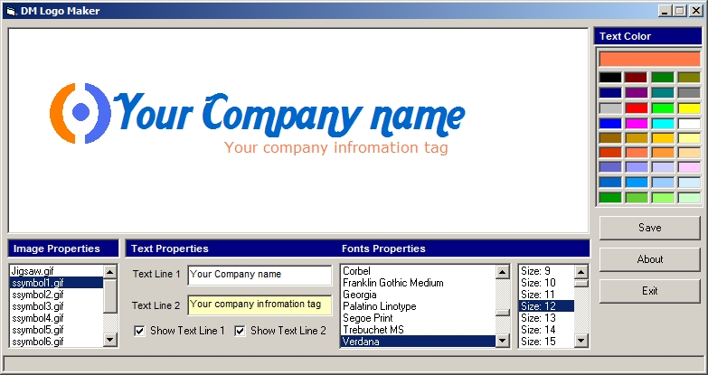



## DM logo Maker V1\.0

### Description

Make a company logo in seconds, Choose an image, position text and set text properties such as fontstyles and colors and save your result Hope you like this first version.
 
### More Info
 

             |
---                |---
**Submitted On**   |2009-11-19 10:37:36
**By**             |[dreamvb](https://github.com/Planet-Source-Code/PSCIndex/blob/master/ByAuthor/dreamvb.md)
**Level**          |Beginner
**User Rating**    |4.8 (24 globes from 5 users)
**Compatibility**  |VB 4\.0 \(32\-bit\), VB 5\.0, VB 6\.0
**Category**       |[Graphics](https://github.com/Planet-Source-Code/PSCIndex/blob/master/ByCategory/graphics__1-46.md)
**World**          |[Visual Basic](https://github.com/Planet-Source-Code/PSCIndex/blob/master/ByWorld/visual-basic.md)
**Archive File**   |[DM\_logo\_Ma21682611202009\.zip](https://github.com/Planet-Source-Code/dreamvb-dm-logo-maker-v1-0__1-72661/archive/master.zip)

